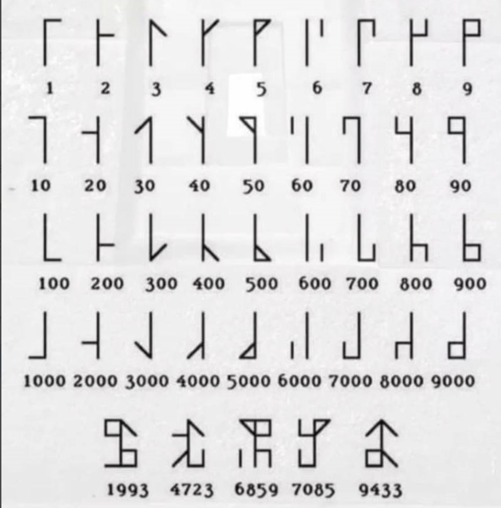
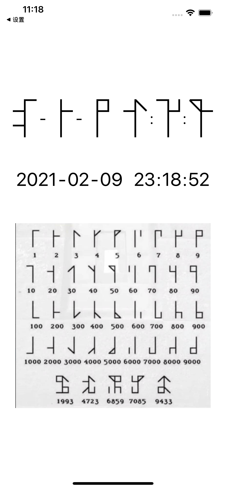

# Cistercian
Cistercian Clock

> The Cistercian monks invented a numbering system in the 13th century which meant that any number from 1 to 9999 could be written using a single symbol

### Link:
https://twitter.com/MathematicsUCL/status/1356558846093914114

https://github.com/TiroTypeworks/Clairvo

